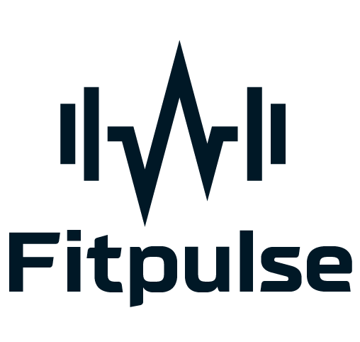

<!-- LOGO -->
 

	
	<h3 align="center">FitPulse - Application Sport et Bien-être</h3>
	

		SAE 3.A.01 - Développement d’application et Gestion de projet  
		IUT de Bayonne et du Pays Basque  
		BUT Informatique 2024-2025 Semestre 3    
	<a href="https://loustaucazauxdavid.github.io/SAE_S3_FitPulse/"><strong>Voir la documentation »</strong></a>

 
<!-- À propos de notre site -->
## À propos de notre site

[![Capture site][capture-site]](_blank)

FitPulse est une application web dédiée au sport et au bien-être, conçue pour répondre aux besoins d'un public jeune et actif. Son objectif principal est de faciliter l'accès aux services de coaching sportif, qu'il s'agisse de personnes en déplacement ou de celles souhaitant trouver des coachs près de chez elles. 

FitPulse connecte les utilisateurs à des professionnels certifiés qui proposent des séances adaptées à leurs besoins et à leur mode de vie.  

Les pratiquants peuvent  réserver des séances au selon leur préférence : en présentielle dans une salle de sport ou en visioconférence. L'application permet ainsi une flexibilité maximale et s'adapte aux contraintes des utilisateurs où qu'ils soient. Les coachs présents sur la plateforme encadrent les pratiquants en leur montrant comment réaliser correctement les exercices et mouvements.

<!-- Instructions de déploiement -->
## Instructions de déploiement

### Prérequis 
  * Git
  * Composer
  * Npm
  * Serveur Apache et PHP avec l'extension PDO

### Étapes de déploiement

**Le fichier SQL inclus à la racine du dépôt contient les tables et données nécessaires au déploiement.**

1. Cloner le dépôt Git de FitPulse à l'aide de la commande suivante :
`git clone https://github.com/loustaucazauxdavid/SAE_S3_FitPulse.git`

2. Installer les dépendances du project en exécutant les commandes suivantes :
	* Dépendances composer :
`composer install`

	* Dépendances npm :
`npm install`

3. Compiler le fichier SCSS en CSS avec SASS en exécutant la commande suivante :
`sass SCSS/custom.scss css/styles.css`

4. Modifier les informations de connexion à la base de données dans le fichier de configuration de la base de données.
Le dossier `config` à la racine de l'application contient les fichiers de configuration de l'application. Par défaut, ce dossier est vide.

**Les modèles des fichiers de configuration sont disponibles dans le dossier `default_config` à la racine de l'application.**
Il vous faudra copier les modèles des fichiers de configuration dans ce dossier puis, à minima, entrer les informations de connexion à votre base de données.

**Les fichiers de configuration sont documentés dans le README du dossier `default_config`.**

5. Déployer le site web sur un serveur Apache et PHP (version 8.0 ou supérieur) avec l'extension PDO activée.
	
<!-- Réalisé avec -->
## Réalisé avec

* [![Bootstrap][Bootstrap-logo]][Bootstrap-url]
* [![Doxygen][Doxygen-logo]][Doxygen-url]
* [![Sass][Sass-logo]][Sass-url]
* [![Twig][Twig-logo]][Twig-url]

<!-- Membres du groupe -->
## Membre du groupe

<ul>
	<li>BERGOS Ugo (Scrum Master & Développeur)</li>
	<li>CECILIA URRA Christopher (Développeur)</li>
	<li>JEANNIN-LAORDEN Guillem (Développeur)</li>
	<li>KLEIN-POL Manon (Product Owner & Développeur)</li>
	<li>LOUSTAU-CAZAUX David (Développeur)</li>
</ul>
 

	

 

<!-- LIENS/IMAGES -->

[capture-site]: images/README/capture.jpg
[Bootstrap-logo]: https://img.shields.io/badge/Bootstrap-563D7C?style=for-the-badge&logo=bootstrap&logoColor=white
[Bootstrap-url]: https://getbootstrap.com
[Twig-logo]: https://img.shields.io/badge/Twig-000000?style=for-the-badge&logo=symfony&logoColor=white
[Twig-url]: https://twig.symfony.com/
[Sass-logo]: https://img.shields.io/badge/Sass-CC6699?style=for-the-badge&logo=sass&logoColor=white
[Sass-url]: https://sass-lang.com/
[Doxygen-logo]: https://img.shields.io/badge/Doxygen-2C4AA8?style=for-the-badge&logo=doxygen&logoColor=white
[Doxygen-url]: https://www.doxygen.nl/